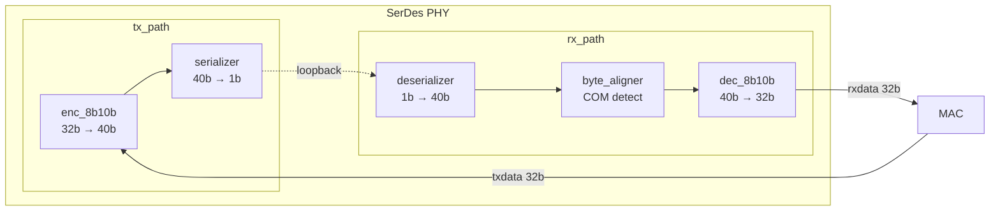

# PCIe SerDes PHY Behavior Model

## 目标

本项目用于实现一个面向仿真的 PCIe SerDes PHY 行为模型，用于联调现有 Verilog MAC。

第一版只关注最小数据通路，优先把编解码连接、并行环回和 TX 串化打通。

## 第一版范围

- 只实现本端 PHY
- 不接对端 VIP / BFM
- 复用现有 8b/10b codec，不重复实现编码器
- MAC 侧接口宽度为 `32-bit`
- 顶层不输入外部工作时钟，时钟由模型内部产生
- `pclk` 由内部 `serial_clk` 分频导出
- TX 路径为 `32-bit -> 40-bit encode -> serial_tx`
- RX 路径为 `TX 串行数据 -> 串并转换 -> decode -> 32-bit`
- RX 对外提供 `rx_valid` 指示 `rxdata/rxdatak` 何时有效
- `tx_code[39:0]` 作为调试观察口保留
- Rx通过COM pattern进行字节对齐

## 第一版验证case ：./sim/tc/ts1_single_word_loopback_test.sv
输入32bit TS1数据经过Tx编码和并串转换后环回Rx，Rx进行串并转换和COM对齐以及解码

## 第一版不包含
- byte align 持续监测
- 复杂 PIPE 控制语义
- 多 lane
- 电气空闲、功耗状态、速率切换
- 对端链路行为建模
- 真正的 TX 串行到 RX 串行闭环恢复

## 架构



## 关键约定

- `tx_code[39]` 为最先发送的 bit
- `tx_code[0]` 为最后发送的 bit
- serializer 按 `MSB-first` 输出
- 第一版固定 `serial_clk : pclk = 40 : 1`
- TX 和 RX 使用同一时钟源
- TX的串行数据在TB内部进行任意延时环回输入给RX

## 当前状态

- 已建立最小骨架：
  - `rtl/pcie_phy_model_top.sv`
  - `rtl/tx_path.sv`
  - `rtl/rx_path.sv`
  - `rtl/serializer.sv`
- TX 已接入现有 encoder：
  - `rtl/enc_8b10b_4bytes.v`
  - `rtl/enc_8b10b.v`
- RX 已完成基于 `dec_10b8b.v` 的 40b->32b 解码接线：
  - `rtl/decoder_8b10b_40to32.sv` 负责 4 组 `10b` 并行解码与 disparity 级联
  - `rtl/rx_path.sv` 负责寄存输出与 `rx_valid`、`decode_err`、`disp_err` 对外接口
- 工程内保留了原始 4-byte decoder 相关文件，当前版本尚未切换到该链路：
  - `rtl/dec_10b8b.v`
  - `rtl/dec_10b8b_4bytes.v`
  - `rtl/dec_10b8b_4bytes_gpcs_glue.v`
  - `rtl/dec_10b8b_4bytes_pipe_glue.v`
- TB 串行环回支持可配置链路延时（`link_delay`），用于测试 byte alignment
- `deserializer` 为常开模块，复位后持续移位，通过 pclk 边沿检测锁存 + pclk 寄存器实现 serial_clk→pclk 跨时钟域
- `byte_aligner` 通过识别 K28.5 (COM) pattern 在 10 个可能 bit offset 中检测并锁定符号边界，输出对齐后的 40-bit 数据
- RX 数据通路：`deserializer → byte_aligner → decoder_8b10b_40to32 → rx_path 输出寄存器`
- 当前 serializer 已按 `MSB-first` 实现，并在无新有效字输入时返回 idle
- RX 输出已提供 `rx_valid`，并在 RX 侧寄存器上补充 `#\`PCS_PD` C2Q 建模
- DV 环境已搭建（`sim/`），含基础 testbench 框架：
  - `smoke_test` — 最小冒烟测试
  - `ts1_tx_test` — 发送连续 TS1 Ordered Set 并检查 `tx_code` 输出
  - `ts1_rx_decode_test` — 连续 TS1 Ordered Set 环回解码检查
  - `ts1_single_word_loopback_test` — 单个 TS1 word 环回解码检查

## 目录

```text
serdes_phy_model/
├── README.md
├── rtl/
│   ├── pcie_phy_model_top.sv
│   ├── tx_path.sv
│   ├── rx_path.sv
│   ├── serializer.sv
│   ├── rtl_timescale.v
│   ├── enc_8b10b_4bytes.v
│   ├── enc_8b10b.v
│   ├── dec_10b8b.v
│   ├── dec_10b8b_4bytes.v
│   ├── dec_10b8b_4bytes_gpcs_glue.v
│   ├── dec_10b8b_4bytes_pipe_glue.v
│   ├── decoder_8b10b_40to32.sv
│   ├── deserializer.sv
│   └── byte_aligner.sv
└── sim/
    ├── Makefile
    ├── filelist.f
    ├── tb/
    └── tc/
        ├── tc_dispatch.svh
        ├── smoke_test.sv
        ├── ts1_rx_decode_test.sv
        ├── ts1_single_word_loopback_test.sv
        └── ts1_tx_test.sv
```

## 下一步

- tx串行发送顺序反向
- byte_aligner 持续监测：失锁后自动重新搜索 COM
- DV验证环境完善（checker、driver）